大部分开发人员都会用到接口文档管理工具，比较常用的有Swagger，ApiDoc等，当然还有Office Word和Excel。

平时不是说代码是最好的文档嘛，为什么还需要用到接口文档？有这些原因必需使用接口文档：

* 前后端团队的并行开发，以及测试人员的提前介入准备，都需要有接口契约文档
* 跨项目组的开发对接，需要有非常正式的接口文档
* 项目结项后，需要给客户或者未来的维护人员留下准确详细的文档以备万一

正因为以上需求，所以我们往往需要在设计接口之后就尽早提供出接口文档。接口文档文档也因此而生，它们会有这些功能：

* 通过代码注解或者注释或者分析源码，直接生成接口文档
* 在接口发生变化后，能够方便更新和再发布文档
* 生成的文档有友好的界面，可以对各个功能模块下的接口分门别类，也可以进行搜索，以及支持接口的多个版本
* 帮助生成Mock数据，以及支持自动化测试

简而言之，为了解放开发人员写文档的繁复工作，接口文档工具应用而生。

但不同的接口文档管理工具背后体现的是不同的开发理念，本篇会通过比较市场上常见的接口文档工具，帮助项目团队选择适合他们的工具。

首先，对接口文档管理工具进行简单分类：

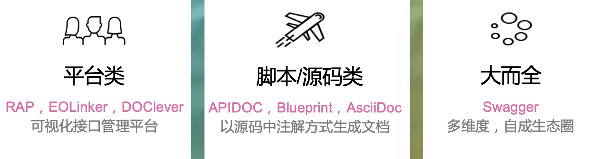

### 平台类
	
代表：RAP，EOLinker，DOClever等

> 	类似于SaaS平台，让用户可以在平台上设计接口，并且平台负责提供接口文档，Mock数据以及自动化测试等功能
	
###  脚本/源码类

代表：APIDOC，Blueprint，Ascii DOC等

> 	偏向于开发人员视角，通过代码注释或者注解或者类似markdown等特定结构定义接口，并且在此基础上可以进行二次开发出类似于Mock数据等扩展型功能

###  大而全如Swagger类

代表：Swagger

>  主要是Swagger为代表，也是平台类如RAP等工具的最终目标。构建出一个可以自成生态圈的多维度的满足各个应用场景的闭环工具
	
	
	
分类大抵如此，接下来会一一介绍。首先来看平台类接口管理工具（因为接口管理平台不仅限于接口文档，它还提供Mock数据，自动化测试功能，因此不再称其为接口文档管理平台）

---

###   RAP

*RAP源于阿里，开源，免费，是一个可视化接口管理平台*

官网：
> http://rap2.taobao.org/

RAP可以定义接口结构，动态生成模拟数据，校验真实接口正确性。围绕接口定义，提供了一系列包括团队管理，项目管理，文档版本管理，mock插件等服务。

RAP官网的宣传语：

* 特色：可视化编辑，完善的版本控制，能够生成Mock数据
* 用户：覆盖阿里20个部门，有200+公司正在使用RAP

如何使用？

* 可以建私库，也可以在平台上进行团队私有管理，手工创建接口
* 可以导入基于API Blueprint格式的API文档直接生成

界面如下：

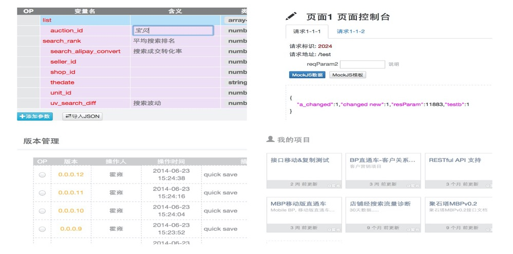

我们可以在官网看到它发展得很快，毕竟有阿里血统：

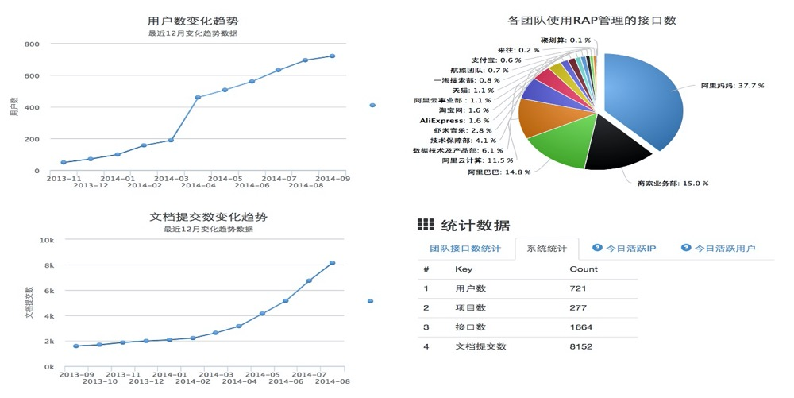

RAP理想中的用户使用流程图：

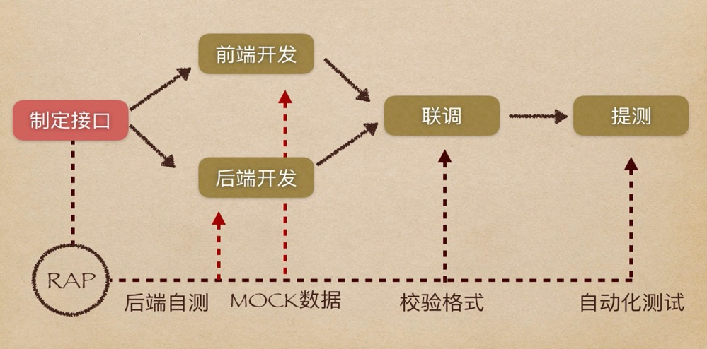

从流程图中可以看出RAP还是很有野心，它并不是把自己定义为一款接口文档管理工具，而是更希望它是一款基于接口的工作流管理平台，前后端可以在它平台上完成接口定义，联调，测试等一系列工作！

**总结**：

* 平台类接口管理的特点是支持可视化编辑，比较适合不接触代码的PM和BA角色管理接口
*  平台支持一些简单的规则能够随机生成响应数据，在一定程度上可以提高测试效率，尽快发现问题。但是缺点是和平台绑得比较死，并且移植性欠佳

平台类工具大多比较雷同，都是以接口文档管理作为切入口，然后又会扩展到Mock数据以及自动化测试上，希望自己作为SaaS平台可以承担更多的职责。每个平台类工具所不同的多是流行程度和功能强弱，因此本篇不再介绍介绍其它平台类接口管理工具。

我们接着看基于源码的文档生成工具，主要介绍 **APIDOC** 这一跨语言的工具，并且介绍一款我基于APIDOC格式进行开发一款脚手架工具 **ApiHelper**，然后会简单介绍 **Blueprint** 以及 **Spring REST Docs**。

---

### APIDOC

*支持多种语言，以代码注释的形式生成API文档*

官网

> https://apidocjs.com/

接口的注释维护起来更加方便，不需要额外再维护一份文档，并且支持市面上绝大部分主流编程语言，如 Java, Python, Javascript, Ruby, Perl, Erlang, Go，Coffescript，Elixir，Lua等等。

线上DMEO：

> https://apidocjs.com/example/

如何使用：

> 用户要以其规定的格式进行书写标识接口的URL， Method，Request，Response等。如下：
> 
> 	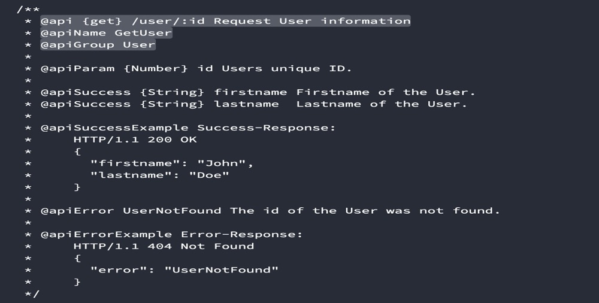

**总结**：

APIDOC 其实只是一个非常简单可以提供静态接口HTML文档的工具。它胜在简单和多语言支持，但缺点也很明显，就是仍然需要在代码中写注释——虽然可以说比Swagger引入Jar而言侵入性要小，但是仍然需要不小的人工成本，在代码中去书写冗长的注释。另外一个缺点就是它功能单一，缺乏Mock数据等功能。

**我的扩展**：

我写了一个通过读JAVA源码，生成APIDOC可识别的注释文件的**API Hepler**工具，完全避免了对项目源代码的侵入，并且在此基础上，可以生成Mock数据，以及能够生成Postman的导入文件，便于把接口直接导入Postman中进行测试。也支持把接口文档导出为Markdown格式。

---

### Api Helper

官网：

> https://github.com/xuziping/ApiHelper

特点：

* 支持生成 API DOC可解析的注释
* 支持生成 Markdown文档
* 支持生成 Mock数据
* 支持 Postman请求
* 提供自定义模板，便于定制开发
* GitHub开源

**总结**：

API Helper本质上就是补充 APIDOC 只是一个文档管理工具的缺憾。事实上，最初写这个工具就是不想在源代码里写太多注释，一方面要遵照APIDOC比较枯燥乏味，另外，太长的注释出现在源码中也不见得有很好的可读性。

在实现API Helper这一个工具的过程中，发现其实文档工具通过解析源码，很容易就能做到类似于Mock数据，代码校验等功能。在一步步扩展出这些功能的同时，也顺带支持了生成Postman格式文档以及生成可供Confluence等接受的Markdown文档，以及支持用户的自定义。

具体怎么使用这个工具感兴趣的朋友可以自己去我的Github上去看，使用或者二次开发中有什么问题也欢迎和我交流。

---

### Spring REST Docs

*类APIDOC的解决方案，基于Asciidoc格式手写文档和单元测试自动生成文档*

官网：

> https://spring.io/projects/spring-restdocs

特点：

* 手写文档时可以使用 Asciidoc 和 Markdown 两种格式
* 自动生成的部分是基于单元测试的，所以可以保证文档的准确性，否则单元测试就会失败
* Spring REST Docs 提供了对 Spring MVC 的 MockMvc、WebFlux 的 WebTestClient 和 REST Assured 的支持

如何使用：

> 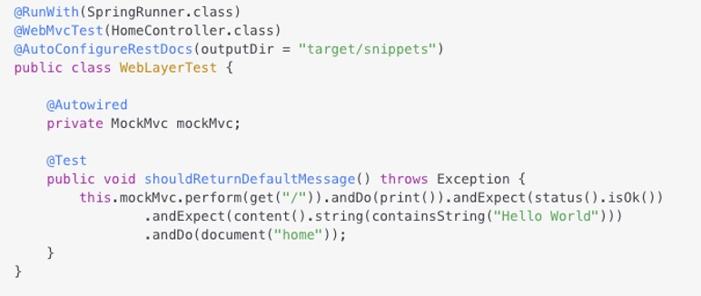
> 
> 新的注解是 @AutoConfigureRestDocs（来自 Spring Boot），该注解的参数作为生成代码片段的位，而新的断言是 MockMvcRestDocumentation.document() ，它的参数作为代码段的字符串标识符。
> 
> 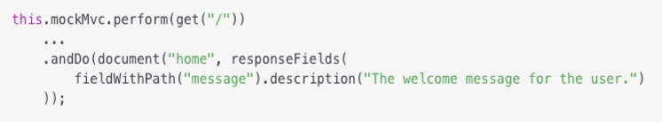
> 
> 我们可以在测试中向 document() 添加断言来创建其他代码段。例如，可以用 PayloadDocumentation.responseFields() 代码段记录JSON响应中的每个字段。

**总结**：

Spring REST Docs主要还是写这篇的时候进行了解，自己在项目中并没有用过。通过上面介绍如何使用，我想你大概对Spring REST Docs有了一个初步的概念。

从我的角度来看，我觉得Spring REST Docs除了拥有Spring的“血脉”外，乏善可陈。它通过单元测试来有相当侵入性地“文档化”接口，这就和单元测试有非常强的耦合性，不论对测试还是对文档而言都不是一个很好的管理方式。并且国内大多数开发人员并不贯彻TDD，文档等到写单元测试的时候再提供似乎有点晚了。

---

### Blueprint

*API Blueprint 是一种类似Markdown的用来编写API文档标记语言*

官网：

> https://apiblueprint.org/

就可以把 Blueprint 看作是一款有特定格式的标记型语言，也因此把它归类在脚本/源码类接口文档管理工具中。你是否还记得上文介绍的阿里的RAP就支持导入Blueprint格式的文件来生成接口，Blueprint的定位本质上就是介于Markdown，Office DOC这类直写元接口的工具上，但不同的是后者是工具，而Blueprint更像是一种书写规范/契约。

接下去看下 Blueprint 怎么使用：

* 生成文档：

	配合工具（Aglio） 可以生成有特定风格样式并且支持搜索的静态 html 文档

	> 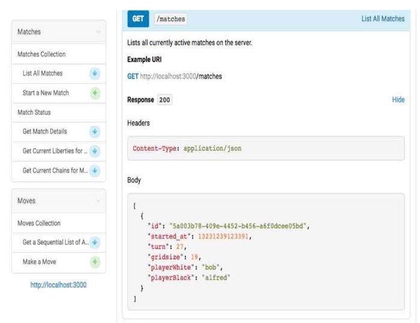

* 生成Mock数据

	配合工具（Drakov）可以生成启动 mock data 服务
	
	> 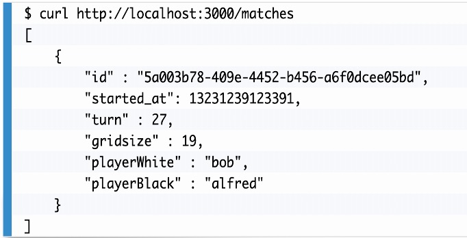

**总结**：

Blueprint 作为一门类似Markdown的指定API文档格式的标记语言，本身是很轻量级的。并且它通过和其它工具组合的方式可以生成接口文档，也可以生成Mock数据，我相信它也完全可以做测试契约使用。在这点上，它的设计理念，忽略平台和源码，小而无侵入，是非常棒的！但它的挑战在于是否有更多的工具来支持它，它的生态圈是否能够丰富和健康发展将会是它能否成为挑战Swagger的最关键的因素。

---

### Swagger

*一个大而全的生态圈*

官网：

> https://swagger.io/

首先根据官网介绍，看下Swagger大家族都有哪些家伙：

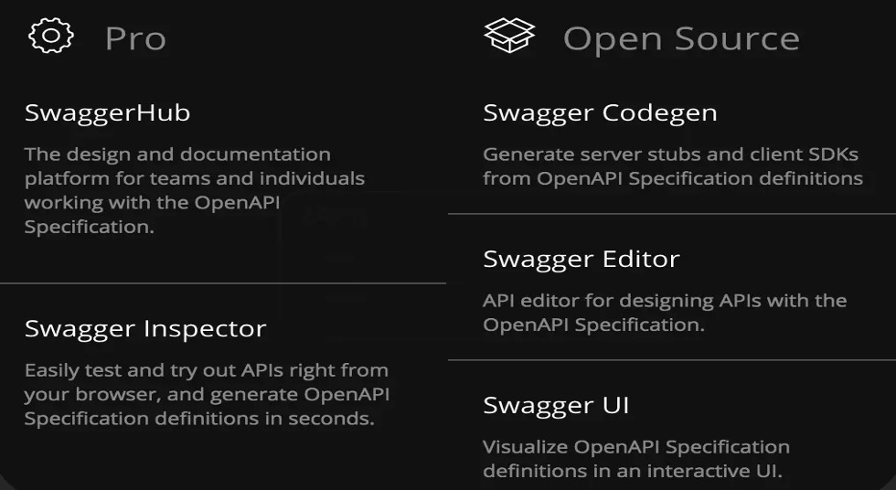

Swagger是一套围绕OpenAPI规范构建的开源工具，便于构建和使用API。常用的有Swagger UI， Swagger Editor 以及 Swagger Codegen，目前大部分项目仅仅使用了Swagger UI而已。

* Swagger Codegen: 

	> 通过 Codegen 工具可以将描述文件生成为html接口文档，同时也可以生成各种语言的服务端和客户端的代码
	>
	> 支持通过jar包，docker，node等方式在本地化执行生成，也支持在Swagger Editor中在线生成代码

* Swagger UI: 

	>  这个可能是大部分开发者用得最多的一个工具。Swagger UI提供一个可视化的UI页面展示描述文件
	>
	>   在这个展示页面中，DEV，BA，PM，QA等等角色都可以在这个页面中对相关接口进行查阅和做一些简单的接口请求
	>
	>  支持在线导入描述文件和本地部署UI项目

* Swagger Editor: 

	> 类似于Markdown编辑器，可以直接编辑Swagger描述文件，可能很多开发者不会这么使用，但事实上它是一个非常好用和强大的工具，我们可以基于它实现接口契约
	>
	> 支持实时预览描述文件的更新效果，同样也提供了在线编辑器和本地部署编辑器两种方式

* Swagger Inspector: 

	> 类似在线版的Postman。比在Swagger UI里面做接口请求，会返回更多的信息，也会保存你请求的实际请求参数等数据

* Swagger Hub：

	> 在Swagger Hub中集成了上面所有项目的各个功能，可以完成上面项目的所有工作

* Springfox Swagger

	> 同 Swagger UI一样，可能是大部分开发者使用最多的一个Swagger家族中的工具了
	>
	> Spring基于Swagger规范，可以将基于SpringMVC和Spring Boot项目的项目代码自动生成Swagger描述文件，进而和Swgger UI结合，可以生成在线文档
	
这是从网上找来的一张各个功能的使用关联图，可以参考下：

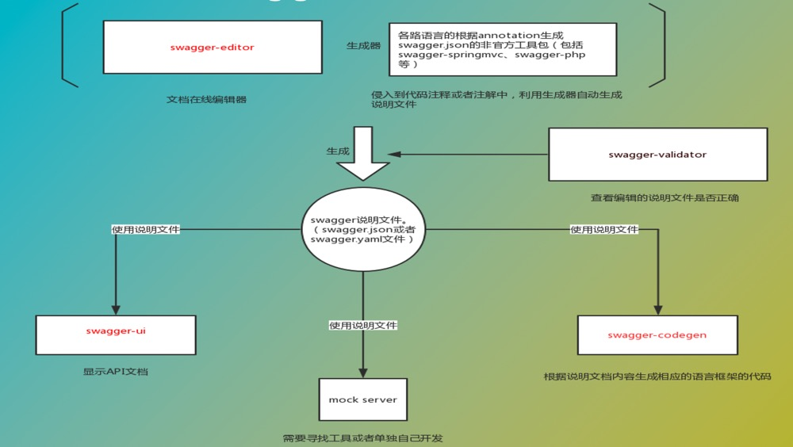

有几点需要注意：

* 如图所示，一切都是围绕Swagger说明文件展开。Swagger说明文件基于 Swagger OpenAPI Specification，这个规范定义了一系列的文件用于描述API，这些文件可以被Swagger-UI项目用来展示API，也可以被Swagger-Codegen项目用来生成代码。一些第三方工具也可以利用这些文件，比如测试工具。

* 图中的mock server有现成产品Easy Mock，它是一个可视化并且能够快速生成模拟数据的持久化服务。它可以通过Swagger OpenAPI Specification一键导入所有接口，省去了手动添加接口的麻烦。

我们平日里使用Swagger一般通过下面两种方式：

* 最常使用的方式，即导入Springfox包，然后在Controller层代码里通过注解来生成文档。如下图：

	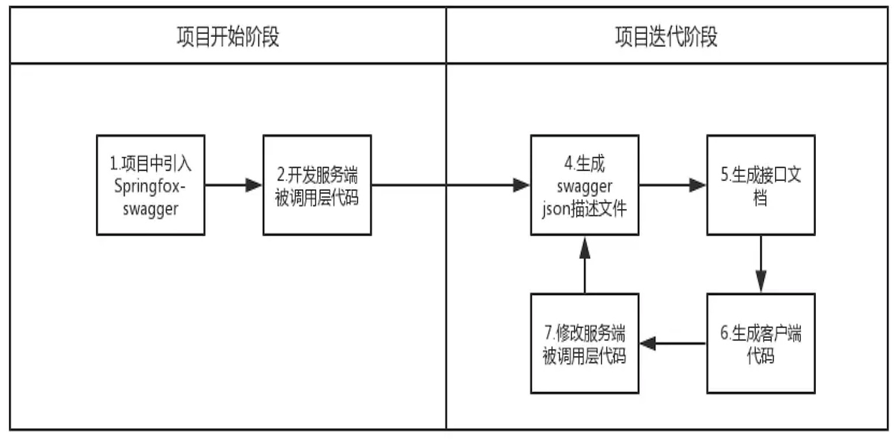
	
	不过由于前后端分离开发，因此右半部分并没有形成一个循环，步骤6会被省去。前端以及测试开发人员会直接消费步骤5生成的文档；当后端接口有变动了，那就是步骤5直接跳到步骤7然后再进行循环。
	
* 还有一种理想情况下使用契约式开发的流程，如下图：

	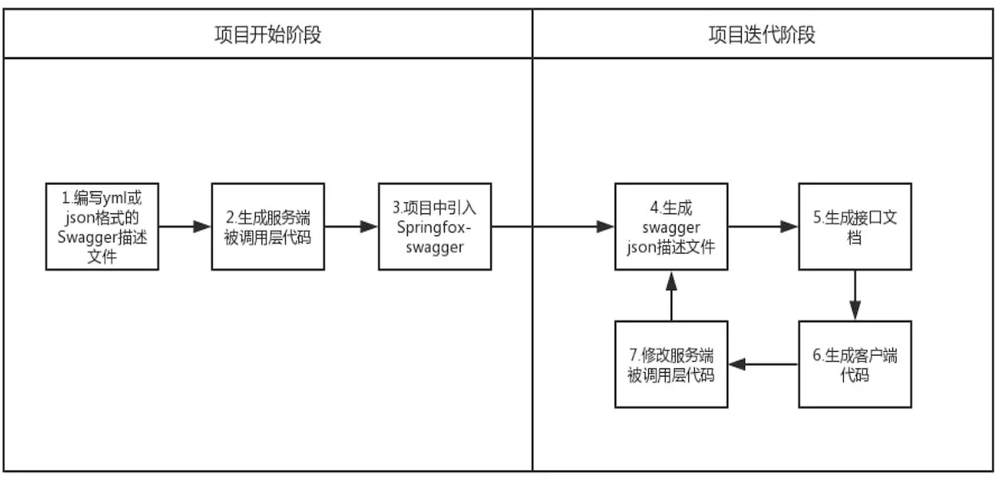
	
	契约就是基于Swagger OpenAPI Specification的Swagger说明文件。通过契约文件分别生成前后端代码，然后如第一种方式使用。
	
	但其实在实际项目开发中我们不太这么使用。原因我觉得可能是这几点，首先比起第一种在源码中加注解的方式要费力，毕竟Swagger OpenAPI规范有点太复杂了，不够轻快。其次，大家都把Swagger定义为一个文档工具，而并不想围绕Swagger去用它生成的代码做开发，因为自动化生成的代码不论可读性和质量都不怎么好。（我是16年左右在一个项目中这么用过，不知道现在是不是做得更好了）
	
	所以一般选择契约式开发，可能就会考虑其它的工具。因为写契约的人很可能是BA或者QA或者其它非技术角色，简单好用更显得重要。
	
**总结**：

Swagger可能是目前市场上做得最成功的一款已经形成生态圈的接口管理工具。它通过Swagger-UI，Swagger OpenAPI Specification以及Springfox等，可以满足使用者各个角度的使用需求。但缺点也因此而来：会有侵入性，并且有时候太过臃肿而复杂，不够恰到好处。

---

### Office Word & Excel

到目前为止，其实还遗漏了一个很重要的接口文档工具，那就是Office家族的Word/Excel，不介绍是因为它们仅是为了满足文档的功能，而没有太多扩展。但使用Word/Excel的开发团队并不少，并且很多是非常复杂的业务项目组对接中使用。对于一些非常严格的并且最终要交付的接口而言，古老的Word/Excel也许真的是最好的选择了。

---

### 如何选取合适的接口工具

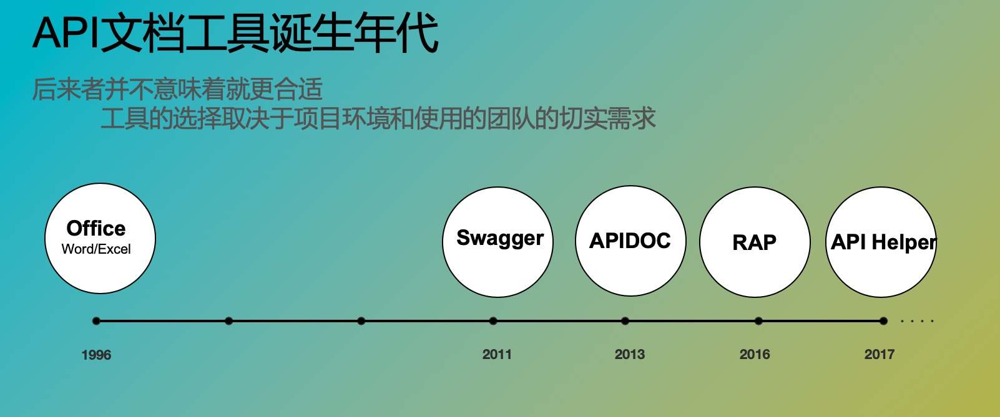

在考虑选择哪一个工具去管理接口前，首先有一个**灵魂三问**：

**1. 是谁负责管理和维护接口文档？**

**2. 是否需要走契约式开发？**

**3. 在接口改动后，是否有有效的机制保证及时沟通？**

这三个问题决定了文档是通过平台手工维护管理，或者源于代码注解，又或者基于契约，哪一个更适合当前的项目环境。我们先来比较下上文中介绍的工具各自的特点：

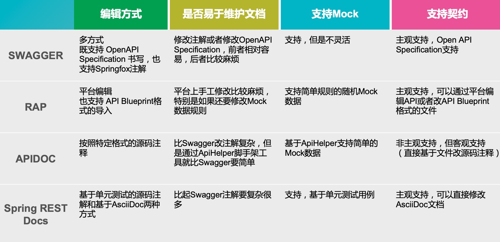

然后我们根据自己项目组织的情况，来决定哪些特性是适合自己团队的：

* 注释型文档保证了开发的效率，开发过程虽然可能会有点混乱，但开发人员可以快速响应变化
* 契约式文档更侧重质量，并且往往和Mock Server一起结合使用
* 使用Office Word和Excel的团队可能服务于大型国有企业或者金融保险行业，项目持续时间长并且业务场景多，接口文档本身就足够复杂，往往会跨越多个团队，要让团队和团队间保证使用同一套接口管理方式是不太现实的，因此Word和Office反而成为了最合适的选择

在了解了自己项目和团队的特性后，其实已经可以确认哪种接口管理方式更适合自己了，最后我们看下各种类型的接口管理方式的优缺点作为收尾吧：

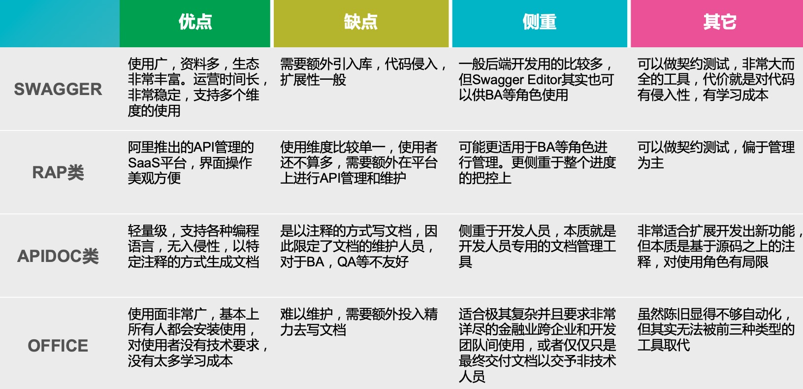

**总结**：

虽然我们每个人都有对技术的追求并且有自己对工具使用上的偏好，但往往决定使用什么是基于项目和团队背景的；并且，往往我们选择的工具会有这样或者那样的缺点和遗憾。

开发人员能做的选择题，很多时候就像冷兵器时代战场上的战士，可选择的范围仅局限在让自己手臂还是腿脚受到左前方或者右后方敌人的伤害，虽然有很多无奈，但这也是项目中最真实的姿态了。

