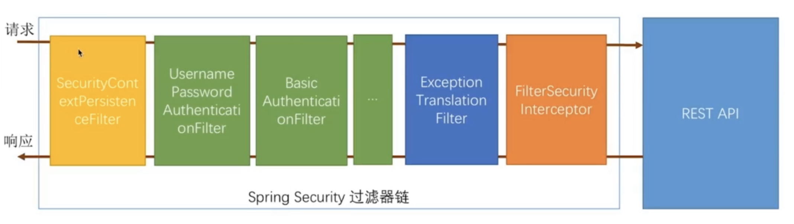

Spring Security是Spring社区的一个顶级项目，也是Spring Boot官方推荐使用的Security框架。Spring Boot当检测到Spring Security存在的时候会自动进行默认配置。

Spring Security通过过滤器链实现，简单的用户名密码的过滤器链如下图：

接下去通过阅读源码，了解Spring Security是如果创建出这个过滤器链的。

我们在使用Spring Security时，通常会在Application启动类或者继承WebSecurityConfigurerAdapter的自定义配置类中加上 **@EnableWebSecurity**，这个注解就是我们这次源码分析的进入点。

可以看到 EnableWebSecurity中引入了WebSecurityConfiguraiton类，如图所示：

点开**WebSecurityConfiguration**类，可以看到这个类的介绍，它通过一个WebSecurity创建FilterChainProxy，而FilterChainProxy就是过滤器链负责最终的安全验证鉴权和授权等职责。WebSecurityConfiguration类中，主要关注两个核心方法：

* public Filter springSecurityFilterChain()

* public void setFilterChainProxySecurityConfigurer(ObjectPostProcessor<Object> objectPostProcessor, List<SecurityConfigurer<Filter, WebSecurity>> webSecurityConfigurers)

